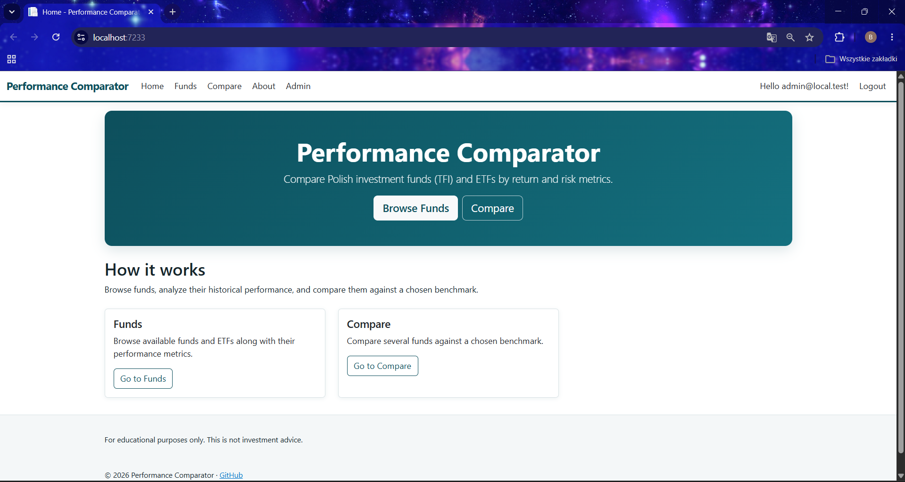
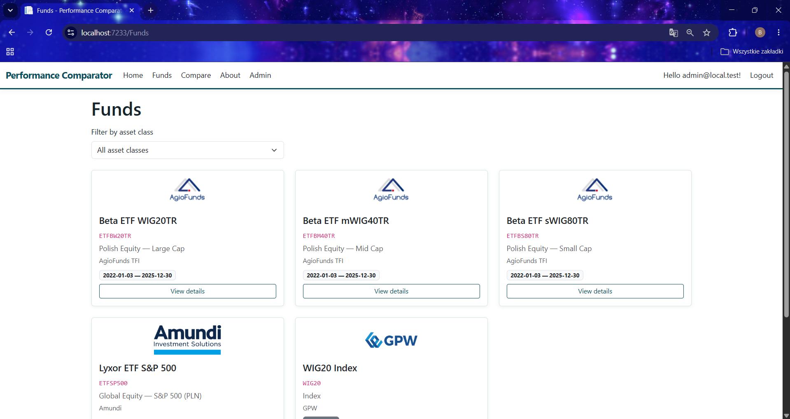
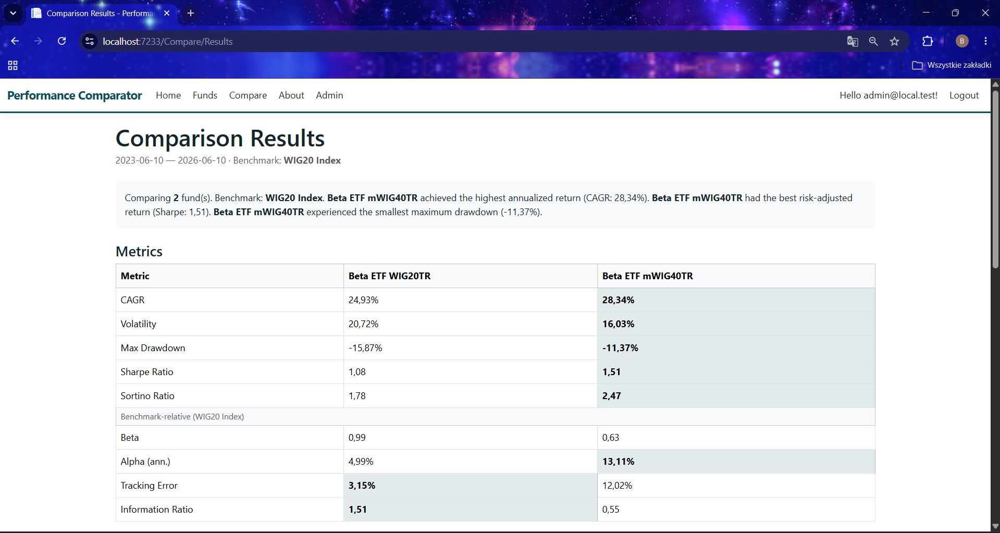
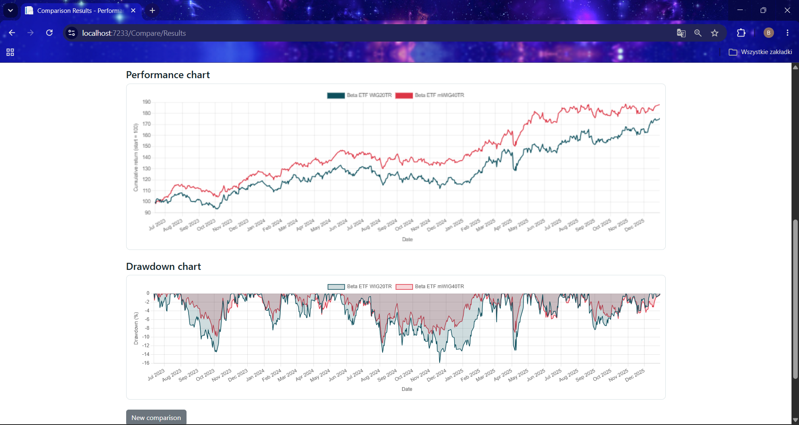
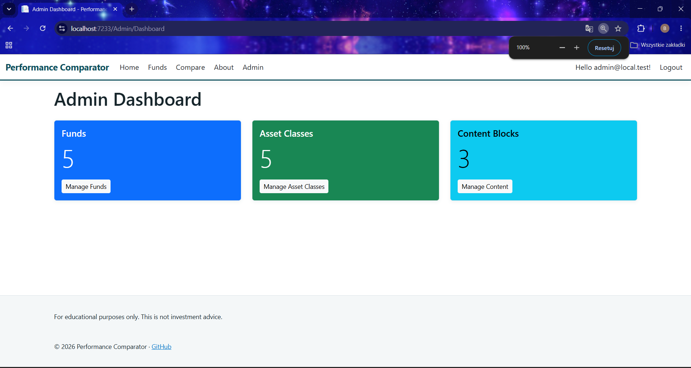

# Performance Comparator

Aplikacja webowa do porównywania polskich funduszy inwestycyjnych (TFI) oraz ETF-ów według
metryk zwrotu i ryzyka. Umożliwia przeglądanie funduszy, analizę ich historycznych wyników
oraz porównywanie ich względem wybranego benchmarku. Zawiera panel administracyjny do
zarządzania funduszami i importu historii cen (NAV) z plików CSV. Projekt zbudowany w
ASP.NET Core MVC na platformie .NET 10.

---

## Zrzuty ekranu


*Strona główna*


*Lista funduszy*


*Porównanie funduszy — tabela metryk*


*Porównanie funduszy — wykresy*


*Panel administracyjny*

---

## Technologie

| Technologia | Wersja / opis |
|---|---|
| .NET | 10 |
| ASP.NET Core MVC | aplikacja wielostronicowa (MPA), renderowanie po stronie serwera (Razor) |
| Entity Framework Core | ORM, dostęp do bazy danych |
| SQLite | baza danych (plik `app.db`) |
| ASP.NET Core Identity | uwierzytelnianie i autoryzacja (rola Admin) |
| Bootstrap | 5 (responsywny interfejs) |
| Chart.js | 4 (interaktywne wykresy) |
| xUnit | testy jednostkowe |

---

## Wymagania

- **.NET 10 SDK** ([pobierz](https://dotnet.microsoft.com/download))
- Visual Studio 2022 (zalecane) **lub** dowolny edytor + .NET CLI
- Git

---

## Jak uruchomić lokalnie

### Ścieżka A — Visual Studio 2022 (zalecana)

1. Sklonuj repozytorium:
   ```
   git clone https://github.com/bartoszopiola/performance-comparator
   ```
2. Otwórz plik `PerformanceComparator.sln` w Visual Studio 2022.
3. Otwórz **Package Manager Console**
   (`Tools → NuGet Package Manager → Package Manager Console`).
4. Upewnij się, że **Default project** jest ustawiony na `PerformanceComparator`,
   a następnie utwórz bazę danych:
   ```
   Update-Database
   ```
5. Uruchom aplikację klawiszem **F5**. Przeglądarka otworzy się automatycznie.

### Ścieżka B — wiersz poleceń (.NET CLI)

1. Sklonuj repozytorium i wejdź do katalogu:
   ```
   git clone https://github.com/bartoszopiola/performance-comparator
   cd performance-comparator
   ```
2. Przywróć zależności:
   ```
   dotnet restore
   ```
3. Utwórz bazę danych (wymaga narzędzia `dotnet-ef`; jeśli go nie masz:
   `dotnet tool install --global dotnet-ef`):
   ```
   dotnet ef database update --project PerformanceComparator
   ```
4. Uruchom aplikację:
   ```
   dotnet run --project PerformanceComparator
   ```
5. Otwórz w przeglądarce adres wypisany w konsoli (np. `https://localhost:7233`).

> **Uwaga:** po pierwszym uruchomieniu baza danych jest **pusta** (nie zawiera funduszy ani
> notowań). Plik bazy `app.db` nie jest częścią repozytorium — tworzony jest lokalnie przez
> `Update-Database`. Aby wypełnić aplikację danymi, postępuj zgodnie z sekcją
> [„Jak zaimportować dane"](#jak-zaimportować-dane) poniżej. Automatycznie tworzone jest
> jedynie konto administratora oraz teksty stron.

---

## Dane logowania do panelu administracyjnego

Konto administratora tworzone jest automatycznie przy pierwszym uruchomieniu:

| Pole | Wartość |
|---|---|
| E-mail | `admin@local.test` |
| Hasło | `Admin123!` |

---

## Jak zaimportować dane

> Aplikacja po sklonowaniu uruchamia się z **pustą bazą danych**. Poniżej znajduje się
> gotowy zestaw do szybkiego wypełnienia jej przykładowymi danymi.

W repozytorium, w katalogu **`samples/`**, znajdują się gotowe pliki CSV z historią cen
(pobrane ze Stooq) dla zestawu polskich instrumentów. Aby załadować dane:

### Krok 1 — zaloguj się jako administrator

Otwórz aplikację, kliknij **Login** (prawy górny róg) i zaloguj się danymi administratora
podanymi wyżej.

### Krok 2 — utwórz klasy aktywów

Przejdź do **Admin → Manage Asset Classes → Create New** i utwórz następujące klasy:

- `Polish Equity — Large Cap`
- `Polish Equity — Mid Cap`
- `Polish Equity — Small Cap`
- `Global Equity — S&P 500 (PLN)`
- `Index`

### Krok 3 — utwórz fundusze

Przejdź do **Admin → Manage Funds → Create New** i utwórz fundusze według tabeli:

| Name | Symbol | Asset Class | Provider | Currency | Is Benchmark |
|---|---|---|---|---|---|
| Beta ETF WIG20TR | ETFBW20TR | Polish Equity — Large Cap | AgioFunds TFI | PLN | nie |
| Beta ETF mWIG40TR | ETFBM40TR | Polish Equity — Mid Cap | AgioFunds TFI | PLN | nie |
| Beta ETF sWIG80TR | ETFBS80TR | Polish Equity — Small Cap | AgioFunds TFI | PLN | nie |
| Lyxor ETF S&P 500 | ETFSP500 | Global Equity — S&P 500 (PLN) | Amundi | PLN | nie |
| WIG20 Index | WIG20 | Index | GPW | PLN | **tak** |

### Krok 4 — wgraj pliki CSV z notowaniami

Dla każdego funduszu kliknij **NAV** na liście funduszy i wgraj odpowiedni plik z katalogu
`samples/`:

| Fundusz | Plik z `samples/` |
|---|---|
| Beta ETF WIG20TR | `etfbw20tr.csv` |
| Beta ETF mWIG40TR | `etfbm40tr.csv` |
| Beta ETF sWIG80TR | `etfbs80tr.csv` |
| Lyxor ETF S&P 500 | `etfsp500.csv` |
| WIG20 Index | `wig20.csv` |

Po wgraniu zobaczysz komunikat z liczbą dodanych rekordów.

### (Opcjonalnie) Pobranie świeższych danych ze Stooq

Aby pobrać aktualne dane samodzielnie, wejdź na stronę instrumentu, np.:
```
https://stooq.pl/q/d/?s=etfbw20tr.pl
```
Przewiń stronę na dół i kliknij **„Pobierz dane w pliku CSV"**.

> **Uwaga:** bezpośrednie linki API (`/q/d/l/?s=...`) mogą wymagać klucza API —
> korzystaj ze strony instrumentu i przycisku na dole strony.

Obsługiwane formaty CSV:
- **Stooq:** `Data,Otwarcie,Najwyzszy,Najnizszy,Zamkniecie,Wolumen` (używana jest kolumna
  `Zamkniecie`)
- **Prosty:** `date,value` (lub `date,nav`)

---

## Struktura projektu

```
PerformanceComparator/
├── Areas/Admin/          # panel administracyjny (kontrolery, widoki)
├── Controllers/          # kontrolery publiczne (Home, Funds, Compare)
├── Data/                 # ApplicationDbContext, SeedData, migracje
├── Models/               # encje EF Core (Fund, AssetClass, NavRecord, ContentBlock)
├── Services/             # logika obliczeniowa (kalkulatory, importer, porównanie)
├── ViewModels/           # modele widoków
├── Views/                # widoki Razor
├── wwwroot/              # CSS, JS (Chart.js), wgrane logo
└── Program.cs            # konfiguracja aplikacji (DI, pipeline)

PerformanceComparator.Tests/   # testy jednostkowe (xUnit)
samples/                       # przykładowe pliki CSV z notowaniami (do importu)
docs/                          # dokumentacja i zrzuty ekranu
```

---

## Funkcjonalności

- Przeglądanie listy funduszy i ETF-ów z filtrowaniem po klasie aktywów
- Szczegóły funduszu: metryki wynikowe i wykres skumulowanego zwrotu
- Porównywanie 1–4 funduszy względem wybranego benchmarku
- Metryki: zwrot skumulowany, CAGR, zmienność, maksymalne obsunięcie, Sharpe, Sortino,
  Beta, Alpha, Tracking Error, Information Ratio
- Interaktywne wykresy: skumulowany zwrot i obsunięcia kapitału (Chart.js)
- Panel administracyjny: CRUD klas aktywów i funduszy
- Import historii cen NAV z plików CSV (formaty Stooq i prosty)
- Upload logo funduszu
- Zarządzanie treścią stron (edytowalne bloki tekstu)
- Uwierzytelnianie i autoryzacja (rola Admin)

---

*Projekt edukacyjny. Dane wyłącznie w celach edukacyjnych — nie stanowią porady inwestycyjnej.*
