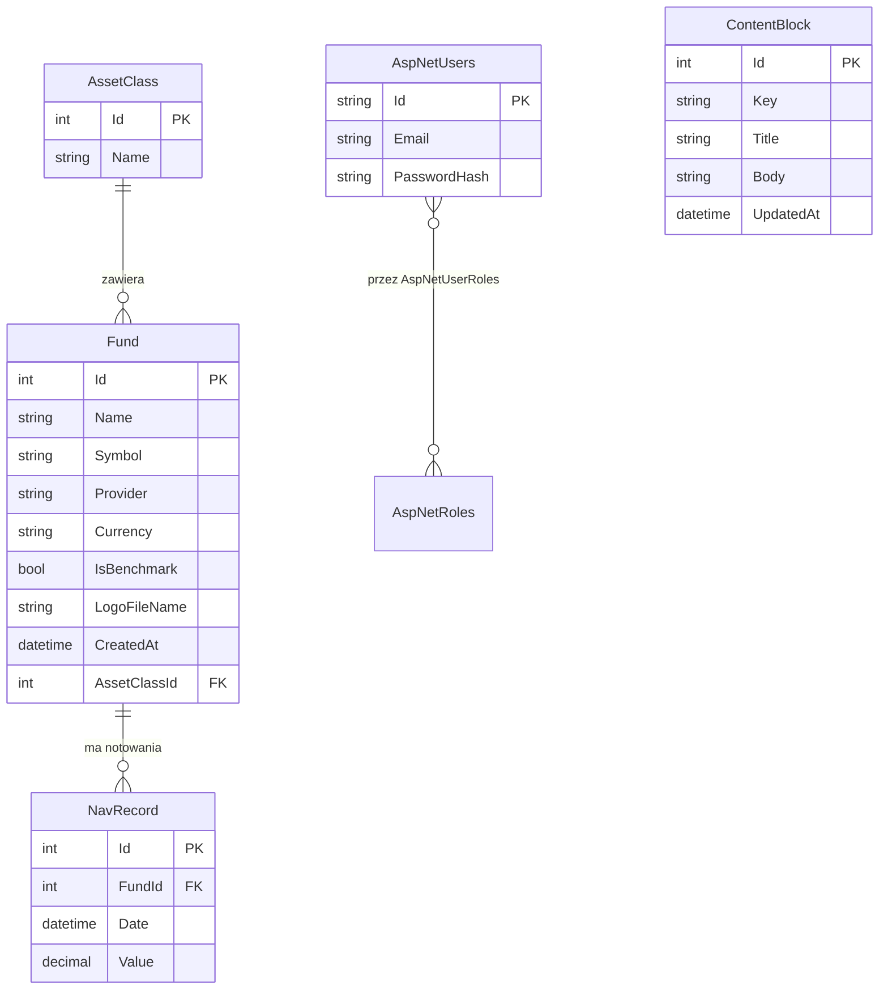

# Dokumentacja techniczna — Performance Comparator

Dokument opisuje architekturę aplikacji, schemat bazy danych, przepływ danych oraz
najważniejsze decyzje projektowe. Przeznaczony dla osoby oceniającej projekt.

---

## Architektura

Aplikacja realizuje wzorzec **MVC (Model-View-Controller)** w ASP.NET Core, z wyraźnym
podziałem na warstwy:

**Kontrolery.** Kontrolery przyjmują żądania HTTP, walidują dane wejściowe,
wołają odpowiednie serwisy i przekazują wynik do widoku. **Nie zawierają logiki
obliczeniowej** — ich rola ogranicza się do sterowania przepływem. Kontrolery publiczne
(`Home`, `Funds`, `Compare`) znajdują się w `Controllers/`, a kontrolery administracyjne
w obszarze `Areas/Admin/`.

**Serwisy (logika).** Cała logika biznesowa i obliczeniowa znajduje się w warstwie
`Services/`. Każdy serwis udostępnia interfejs (np. `IReturnCalculator`) i implementację,
co umożliwia wstrzykiwanie zależności (DI) oraz testowanie w izolacji. Najważniejsze serwisy:
- `ReturnCalculator` — metryki zwrotu (dzienne stopy zwrotu, zwrot skumulowany, CAGR)
- `RiskCalculator` — metryki ryzyka (zmienność, maksymalne obsunięcie, Sharpe, Sortino)
- `BenchmarkCalculator` — metryki względem benchmarku (Beta, Alpha, Tracking Error,
  Information Ratio); wyrównuje serie po dacie (inner join)
- `CsvNavImporter` — import notowań z plików CSV (auto-detekcja formatu, transakcja)
- `ComparisonService` — serwis orkiestrujący: ładuje dane, woła kalkulatory, buduje wynik

**ViewModele.** Do widoków nigdy nie przekazujemy encji bazodanowych. Zamiast tego każdy
widok otrzymuje dedykowany ViewModel (`ViewModels/`), zawierający dokładnie te dane, które
są potrzebne do wyświetlenia. Zapobiega to wyciekowi pól bazy i upraszcza widoki.

**Obszar administracyjny (Area).** Funkcje administracyjne wydzielono do obszaru
`Areas/Admin/` z własnym routingiem. Wszystkie kontrolery w tym obszarze są oznaczone
atrybutem `[Authorize(Roles = "Admin")]`, co chroni je przed dostępem niezalogowanych
użytkowników.

**Uwierzytelnianie.** Realizowane przez **ASP.NET Core Identity** — hasła są hashowane,
sesja przechowywana w bezpiecznym ciasteczku, a dostęp do panelu administracyjnego
kontrolowany rolą `Admin`. Konto administratora oraz rola tworzone są automatycznie przy
starcie aplikacji (`SeedData`).

**Wstrzykiwanie zależności (DI).** Wszystkie serwisy i kontekst bazy rejestrowane są w
kontenerze DI w `Program.cs` (`AddScoped`). ASP.NET Core sam dostarcza je do konstruktorów,
co zmniejsza powiązania między klasami.

---

## Schemat bazy danych

Baza (SQLite) zawiera tabele domenowe oraz tabele Identity. Relacje domenowe:

**Opis tekstowy (ERD):**
- `AssetClass` (klasa aktywów) **1 → wiele** `Fund` — jedna klasa aktywów grupuje wiele
  funduszy. Usunięcie klasy aktywów jest zablokowane, jeśli ma przypisane fundusze (Restrict).
- `Fund` (fundusz) **1 → wiele** `NavRecord` — jeden fundusz ma wiele notowań NAV. Usunięcie
  funduszu kasuje jego notowania (Cascade).
- `NavRecord` posiada **unikalny indeks złożony** `(FundId, Date)` — uniemożliwia zapisanie
  dwóch notowań tego samego funduszu na ten sam dzień.
- `ContentBlock` — niezależna tabela edytowalnych treści (klucz `Key` unikalny).
- `AspNetUsers` (Identity) — użytkownicy; powiązani z rolami przez tabele Identity
  (`AspNetRoles`, `AspNetUserRoles`).

**Diagram (Mermaid):**



**Opis tabel:**

| Tabela | Rola |
|---|---|
| `AssetClass` | kategoria funduszu (np. „Polish Equity — Large Cap”, „Index”) |
| `Fund` | fundusz lub ETF; przechowuje metadane i klucz obcy do klasy aktywów |
| `NavRecord` | pojedyncze notowanie (data + wartość NAV) dla funduszu |
| `ContentBlock` | edytowalne bloki treści wyświetlane na stronach publicznych |
| `AspNetUsers` + tabele Identity | konta użytkowników, role, powiązania |

Precyzja kolumny `NavRecord.Value` to `decimal(18,6)` — zapewnia dokładność wartości
pieniężnych.

---

## Przepływ danych

Typowy cykl życia danych w aplikacji:

1. **Import.** Administrator wgrywa plik CSV przez panel (`Admin → Funds → NAV`).
   `CsvNavImporter` wykrywa format z nagłówka, parsuje daty i wartości, pomija duplikaty
   i zapisuje rekordy do tabeli `NavRecord` w ramach transakcji.
2. **Żądanie porównania.** Użytkownik wybiera fundusze, benchmark, zakres dat i stopę wolną
   od ryzyka w formularzu (`Compare/Index`) i wysyła go (POST do `Compare/Results`).
3. **Obliczenia.** `ComparisonService.CompareAsync` ładuje notowania z bazy (asynchronicznie),
   po czym woła kalkulatory: `ReturnCalculator`, `RiskCalculator` i `BenchmarkCalculator`.
   Buduje obiekt `CompareResultViewModel` z kompletem metryk i seriami danych do wykresów.
4. **Prezentacja.** Kontroler przekazuje ViewModel do widoku Razor (`Compare/Results`).
   Widok renderuje tabelę metryk oraz serializuje serie danych do JSON.
5. **Wykresy.** Skrypt `charts.js` parsuje JSON i rysuje wykresy Chart.js (skumulowany zwrot
   oraz obsunięcia kapitału).

Schemat:

```
Admin → CSV → CsvNavImporter → NavRecord (baza)
                                   │
Użytkownik → formularz → ComparisonService → kalkulatory → CompareResultViewModel
                                                                  │
                                              Razor (Results) + Chart.js → przeglądarka
```

---

## Kluczowe funkcjonalności

### Porównywanie funduszy

Aplikacja oblicza następujące metryki (skrótowy opis sposobu liczenia):

| Metryka | Jak liczona |
|---|---|
| Zwrot skumulowany | `ostatnia_cena / pierwsza_cena − 1` |
| CAGR | `(1 + zwrot_skumulowany)^(252 / liczba_dni) − 1` (252 = dni handlowe w roku) |
| Zmienność | próbkowe odchylenie standardowe dziennych zwrotów × `√252` |
| Maksymalne obsunięcie | największy spadek wartości od dotychczasowego szczytu (liczba ujemna) |
| Sharpe | `(zwrot − stopa wolna od ryzyka) / zmienność` |
| Sortino | jak Sharpe, ale w mianowniku tylko zmienność spadkowa |
| Beta | `kowariancja(fundusz, benchmark) / wariancja(benchmark)` |
| Alpha | alfa Jensena — nadwyżkowy zwrot ponad wynikający z bety (annualizowana) |
| Tracking Error | odchylenie standardowe różnic zwrotów fundusz–benchmark |
| Information Ratio | nadwyżkowy zwrot / Tracking Error |

Obliczenia statystyczne wykonywane są wewnętrznie w typie `double` (pierwiastek, potęga),
a wartości wynikowe i przechowywane — w typie `decimal` (dokładność).

### Panel administracyjny

- **CRUD klas aktywów i funduszy** — tworzenie, edycja, podgląd i usuwanie. Usunięcie klasy
  aktywów z przypisanymi funduszami jest zablokowane (komunikat dla użytkownika).
- **Upload logo** — walidacja rozszerzenia i typu MIME, limit rozmiaru, nazwa pliku
  generowana serwerowo (GUID) zamiast nazwy od użytkownika.
- **Import NAV** — wgrywanie CSV, raport liczby dodanych i pominiętych (duplikaty) rekordów.

### Zarządzanie treścią

Bloki treści (`ContentBlock`) pozwalają administratorowi zmieniać teksty na stronie głównej
i podstronie „O projekcie” bez modyfikacji kodu. Strony publiczne pobierają treść z bazy na
żywo, więc zmiany są widoczne natychmiast.

---

## Najważniejsze decyzje projektowe

**Dlaczego SQLite?** Baza w jednym pliku, bez konieczności instalowania i konfigurowania
serwera bazodanowego. Idealna do projektu edukacyjnego i lokalnego uruchamiania — wystarczy
sklonować repozytorium i wykonać `Update-Database`. EF Core pozwala w razie potrzeby
przełączyć się na inny silnik (np. SQL Server) przy minimalnych zmianach.

**Dlaczego osobna warstwa serwisów?** Wydzielenie logiki obliczeniowej do `Services/`
zapewnia jednolite miejsce dla całej matematyki, ułatwia testowanie (serwisy testujemy bez
uruchamiania aplikacji ani bazy — z danymi w pamięci) i utrzymuje kontrolery cienkimi.
Interfejsy umożliwiają podmianę implementacji i wstrzykiwanie zależności.

**Dlaczego import CSV zamiast API na żywo?** Projekt realizowany jest w fazie 1 (zakres
uniwersytecki), w której dane wprowadza administrator ręcznie poprzez upload plików CSV.
Rezygnacja z integracji z zewnętrznymi API na żywo upraszcza projekt, eliminuje zależność od
dostępności i limitów usług zewnętrznych oraz pozwala skupić się na logice obliczeniowej i
architekturze. Pobieranie danych z zewnętrznych źródeł (np. API) przewidziano jako rozszerzenie
w fazie 2.

**Dlaczego ViewModele zamiast encji w widokach?** Oddzielenie modelu prezentacji od modelu
danych zapobiega przekazywaniu do widoku pól, które nie powinny być widoczne, i pozwala
dostosować kształt danych do potrzeb konkretnego widoku.

**Dlaczego decimal dla wartości?** Typ `decimal` jest dziesiętny i nie wprowadza błędów
zaokrągleń charakterystycznych dla `double`, co jest istotne przy wartościach pieniężnych.
